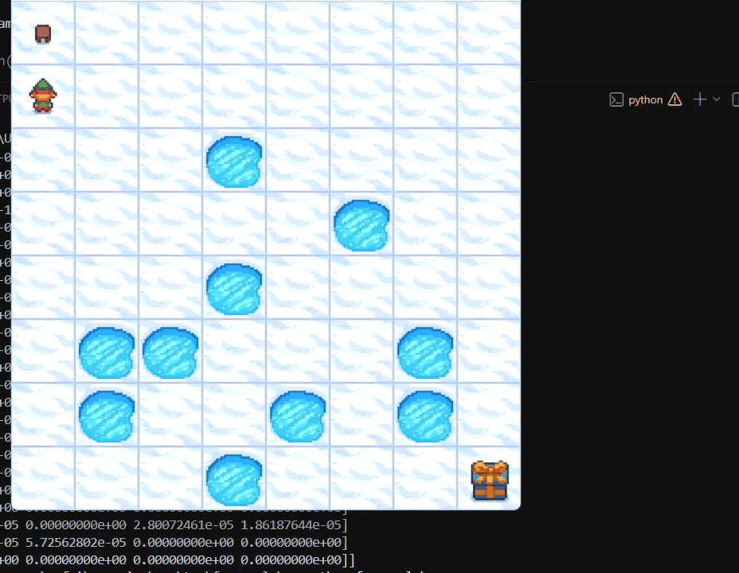
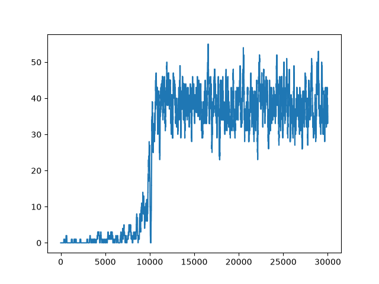

# FrozenLake Q-Learning

A Q-Learning implementation for solving the **FrozenLake-v1** environment from OpenAI Gymnasium. This project was built to understand the fundamentals of **tabular reinforcement learning** before moving on to Deep Q-Networks (DQN) for more complex environments such as CartPole.

## Demo

The trained agent successfully navigates the slippery 8×8 FrozenLake environment.

*(Look at the little guy go! (˶ᵔ ᵕ ᵔ˶))*

<p align="center">
  
</p>

## Learning Curve

The plot below shows the rolling sum of successful episodes over a 100-episode window during training. As training progresses, the agent learns an increasingly effective policy for navigating the frozen lake despite the stochastic (slippery) environment.

<p align="center">
  
</p>

## Environment

- **Environment:** FrozenLake-v1 (8×8)
- **Library:** Gymnasium
- **Map:** 8×8
- **Slippery:** Enabled (`is_slippery=True`)

The objective is to navigate from the start tile to the goal while avoiding holes. Because the environment is slippery, the chosen action is not always the action executed, making the problem stochastic.

## Q-Learning

The agent learns a Q-table that estimates the expected future reward for every state-action pair.

During training, actions are selected using an **ε-greedy policy**:

- Explore by selecting random actions with probability ε.
- Exploit by selecting the action with the highest Q-value.

The Q-table is updated using the Bellman equation:

```text
Q(s,a) ← Q(s,a) + α [r + γ max Q(s',a') − Q(s,a)]
```

where:

- **α** = Learning Rate
- **γ** = Discount Factor
- **r** = Immediate Reward

## Hyperparameters

| Parameter | Value |
|-----------|------:|
| Episodes | 30,000 |
| Learning Rate | 0.9 |
| Discount Factor | 0.9 |
| Initial ε | 1.0 |
| ε Decay | 0.0001 |
| Map Size | 8×8 |
| Slippery Environment | True |

## Project Structure

```text
FrozenLake/
│
├── frozen_lake.py
├── frozen_lake8x8.pkl
├── frozen_lake8x8.png
├── demo.gif
└── README.md
```

## Requirements

```bash
pip install gymnasium[toy-text] numpy matplotlib pygame
```

## Run

Train the agent:

```bash
python frozen_lake.py
```

Evaluate the trained agent:

```python
run(10, is_training=False, render=True)
```

## What I Learned

- Reinforcement Learning fundamentals
- Markov Decision Processes
- Tabular Q-Learning
- ε-greedy exploration
- Bellman updates
- Reward optimization
- Training and evaluating RL agents using Gymnasium

## Acknowledgements

This project was developed as a learning exercise while studying reinforcement learning and Q-learning. The implementation was inspired by and references the excellent Gymnasium reinforcement learning examples by **johnnycode8**.

Repository:
https://github.com/johnnycode8/gym_solutions
